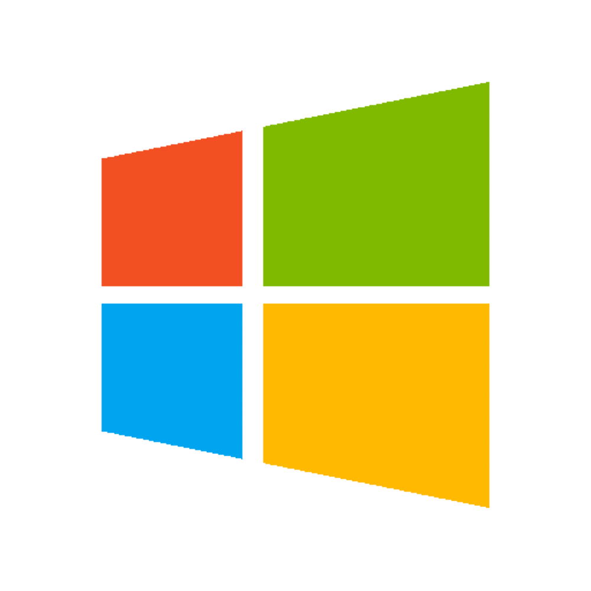

# Manual Instalação e Configuração Docker

## Instalação
###  Windows

<p align="center">
    <a href="https://store.docker.com/editions/community/docker-ce-desktop-windows">
        
    </a>
</p>


Para Windows:
* Crie uma conta em https://www.docker.com/
* Baixe o executável (link disponível na imagem)
* Execute o programa 

_____
### Ubuntu

<p align="center">
    <a href="https://docs.docker.com/install/linux/docker-ce/ubuntu/#set-up-the-repository">
        
    </a>
</p>


Para Ubuntu:
* Crie uma conta em https://www.docker.com/
* Siga o tutorial (link disponível na imagem)


_____

### MacOS

<p align="center">
    <a href="https://store.docker.com/editions/community/docker-ce-desktop-mac">
        
    </a>
</p>

Para MacOS:
* Crie uma conta em [https://www.docker.com](https://www.docker.com)
* Baixe o .pkg (link disponível na imagem)
* Execute-o em seu computador.
* Para verificar se o seu Docker está instalado corretamente siga o seguinte comando:
     ```console
       $ docker --version
     ```
    _Se instalado corretamente:_ 
    ```console
    $ Docker version 18.06.0-ce, build 0ffa825
    ```

* Teste seu Docker com o comando:
    ```console
    $ docker run hello-world
    ```
___

## Configurando Dockerfile simples
* Escolha uma Imagem para seu Dockerfile. No exemplo abaixo usaremos _Ubuntu_ na versão _16.04_
* Coloque a palavra ```FROM``` antes de definir sua imagem como mostrado abaixo:

```dockerfile
FROM ubuntu:16.04
```

* Defina o _mantainer_ do projeto conforme o padrão "nomeMantainer | emailMantainer".
* Coloque a palavra ```LABEL``` antes de definir seu _mantainer_ como mostrado abaixo:


```dockerfile
FROM ubuntu:16.04

LABEL mantainer="Fulano de Tal <ful.ano@email.com>"
```
* Por fim, basta colocar a palavra ```RUN``` e digitar os comandos que são necessários para instalar as dependências no seu Docker. O exemplo abaixo mostra a instalação do JDK 8, ApacheMaven e Git.

```dockerfile
FROM ubuntu:16.04

LABEL mantainer="Fulano de Tal <ful.ano@email.com>"

RUN apt-get update && \
apt-get upgrade && \
apt-get install openjdk-8-jdk maven -y && \
apt-get install git
```
___

## Buildando e executando o Docker
* Para buildar seu Docker, utilize o comando: 
```console
  $  
```
* Após buildado, é possível criar um container em sua máquina utilizando o comando
```console
  $ 
```